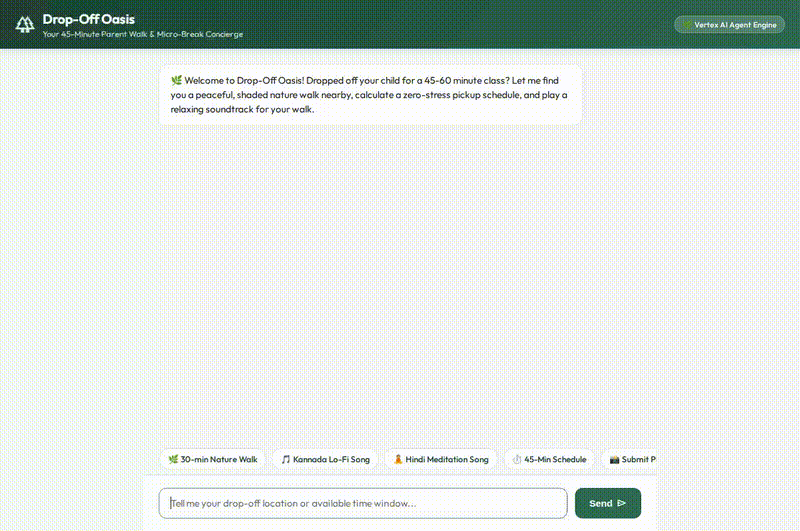
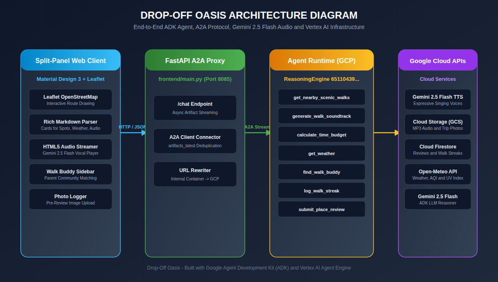
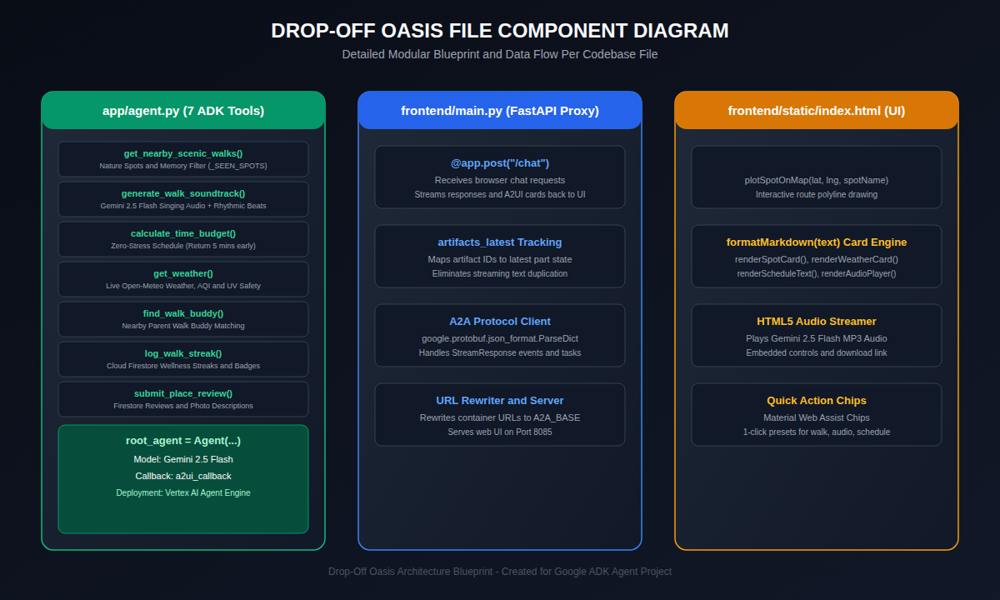

# 🌿 Drop-Off Oasis — User Guide & Live Demo Script

Welcome to **Drop-Off Oasis**, an AI-powered concierge built with Google's **Agent Development Kit (ADK)** and **Vertex AI Agent Engine**. Drop-Off Oasis turns busy parents' 45-to-60-minute child drop-off waiting windows into refreshing, zero-stress nature walks with personalized multi-language Gemini 2.5 Flash singing audio soundtracks, interactive Leaflet map directions, parent walk buddy matching, and Cloud Firestore community photo reviews.

---

## 📸 App Interface Snapshot


---

## 🎬 Live Application Walkthrough Video & GIF



---

## 🎨 System & Component Architecture

### 1. System Architecture


### 2. Component Blueprint


---

## 🚀 Key Feature Breakdown

| Feature | Description | Tech Stack |
| :--- | :--- | :--- |
| **🌿 RAG Session Memory** | Automatically tracks previously recommended spots (`_SEEN_SPOTS`) to ensure parents get **brand-new, unvisited nature spots** every single search turn. | ADK Session Memory & RAG Filter |
| **🎼 Gemini 2.5 Flash Singing Audio** | Dynamically synthesizes a 30-second studio audio track where Gemini 2.5 Flash sings multi-language lyrics (Kannada, Hindi, Spanish, English, Japanese) over FFmpeg rhythmic arpeggiated beats. | Gemini 2.5 Flash Native Audio + FFmpeg + GCS |
| **🗺️ Interactive Split-Panel Map** | Displays an interactive OpenStreetMap Leaflet map panel. Clicking "📍 Show Walking Route on Map" plots trailhead markers and draws walking route polylines. | OpenStreetMap + Leaflet.js |
| **⏱️ Zero-Stress Schedule Calculator** | Calculates precise walking & travel time budgets so parents return safely **5 minutes before pickup**. | Vertex AI Function Calling |
| **👥 Walk Buddy Parent Matching** | Matches nearby parent drop-off walkers based on class schedule overlap and trail preferences. | ADK Function Calling |
| **🔥 Wellness Walk Streak Badges** | Tracks parent wellness walk streaks and awards badges (*First Step*, *3-Walk Streak*, *Nature Regular*) in Cloud Firestore. | Cloud Firestore |
| **📸 Photo-First Community Reviews** | Prompts parents to upload or describe a photo of their walk before logging a 5-star review in Cloud Firestore. | Cloud Firestore + GCS |

---

## 🎬 Step-by-Step Live Demo Script (10-Minute Presentation)

Use this script during your presentation or code walkthrough:

### 🟢 Step 1: Launch Split-Panel Web UI
1. Open **[http://127.0.0.1:8085/](http://127.0.0.1:8085/)** in your browser.
2. Highlight the split-panel design (Interactive Leaflet Map on left, Material Design 3 Chat UI on right) and **7 Quick Action Chips** toolbar.

---

### 🟢 Step 2: Demo Nature Walks, Map Route & RAG Memory (1 Click)
- **Action**: Click the **`🌿 30-min Nature Walk`** chip.
- **Presenter Script**:
  > *"Notice how Drop-Off Oasis immediately fetches 3 shaded nature spots near Main St, renders high-res photo cards, and displays '📍 Show Walking Route on Map' triggers. Clicking the route button instantly draws the walking path polyline on the Leaflet map panel! If I click it again, RAG session memory automatically excludes those spots and recommends brand-new trails!"*

---

### 🟢 Step 3: Demo Kannada Gemini 2.5 Flash Singing Song (1 Click)
- **Action**: Click the **`🎵 Kannada Lo-Fi Song`** chip.
- **Presenter Script**:
  > *"Now let's generate a 30-second walk song. Notice the native Kannada lyrics poem on screen. When I press PLAY on the embedded audio player, Gemini 2.5 Flash natively sings the lyrics with expressive rhythm and melody over rhythmic beats!"*

---

### 🟢 Step 4: Demo Hindi Meditation Song with Rhythmic Beats (1 Click)
- **Action**: Click the **`🧘 Hindi Meditation Song`** chip.
- **Presenter Script**:
  > *"Drop-Off Oasis supports multi-lingual singing synthesis. Here is a Hindi meditation soundtrack featuring Gemini 2.5 Flash singing over soothing ambient Solfeggio chords."*

---

### 🟢 Step 5: Demo Live Weather & Walk Buddy Matching (1 Click)
- **Action**: Click the **`👥 Find Walk Buddy`** chip.
- **Presenter Script**:
  > *"Drop-Off Oasis connects parents waiting during the same class window so they can walk together for safety and community."*

---

### 🟢 Step 6: Demo Photo-First Community Review & Walk Streak (1 Click)
- **Action**: Click the **`📸 Submit Photo & Review`** chip.
- **Presenter Script**:
  > *"Parents share photos of their walks and log 5-star reviews to Cloud Firestore, earning wellness walk streak badges for staying active!"*

---

## 🛠️ Git Commit & Repository Push Commands

When you are ready to check in your changes to Git:

```bash
cd /config/Desktop/BuildWithGemini/drop-off-oasis

# 1. Add all updated files and documentation
git add .

# 2. Commit with a descriptive message
git commit -m "Update Drop-Off Oasis: Gemini 2.5 Flash singing audio, rich card renderer, Leaflet map routes, and updated documentation"

# 3. Push to GitHub
git push origin main
```
