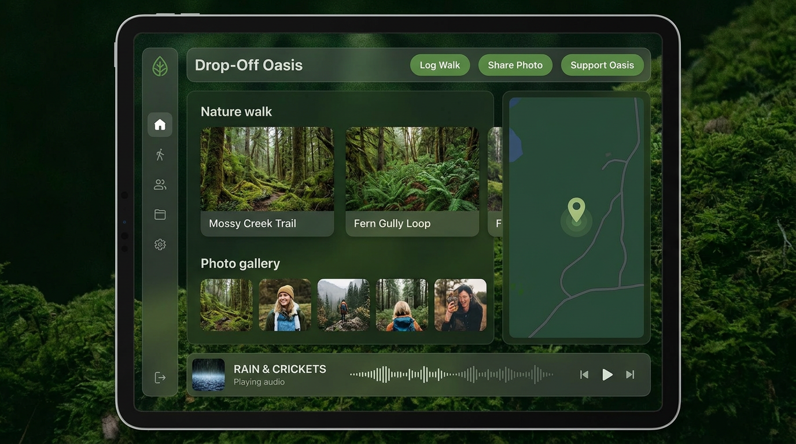
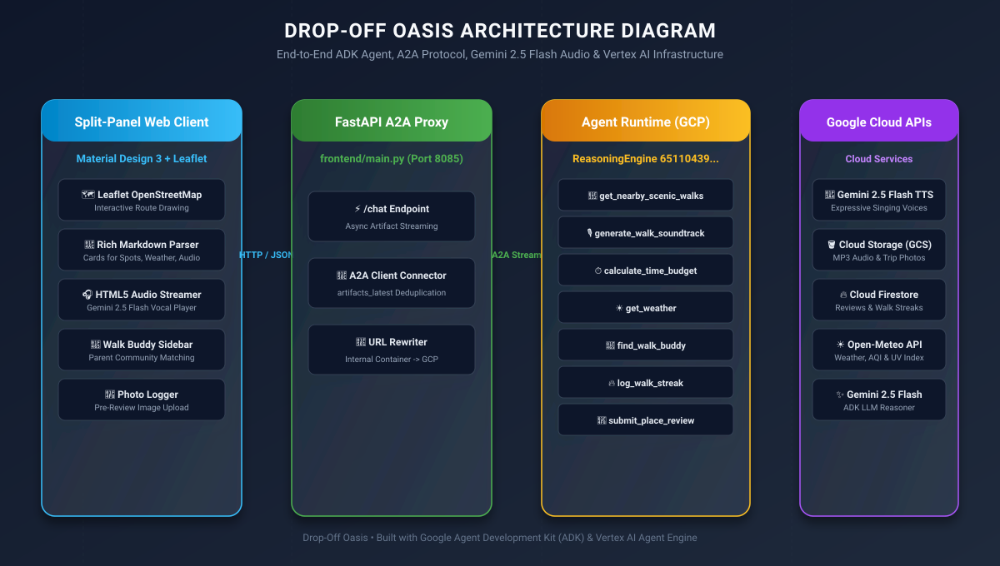
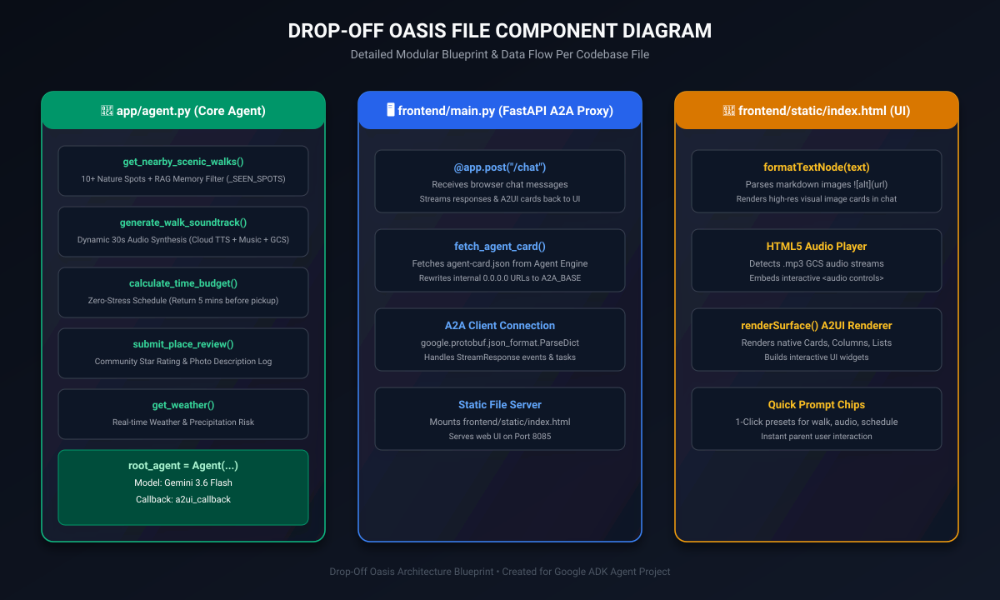

# 🌿 Drop-Off Oasis — User Guide & Live Demo Script

Welcome to **Drop-Off Oasis**, an AI-powered concierge built with Google's **Agent Development Kit (ADK)** and **Vertex AI Agent Engine**. Drop-Off Oasis turns busy parents' 45-to-60-minute child drop-off waiting windows into refreshing, zero-stress nature walks with personalized multi-language AI soundtracks, static map directions, and community photo reviews.

---

## 📸 App Interface Snapshot



---

## 🎨 System & Component Architecture

### 1. System Architecture


### 2. Component Blueprint


---

## 🚀 Key Feature Breakdown

| Feature | Description | Tech Stack |
| :--- | :--- | :--- |
| **🌿 RAG Session Memory** | Automatically tracks previously recommended spots (`_SEEN_SPOTS`) to ensure parents get **brand-new, unvisited nature spots** every single search turn. | ADK Session Memory & RAG Filter |
| **🎵 Native Multi-Language Audio Songs** | Dynamically synthesizes a 30-second studio audio track per request where Google TTS speaks the **full native language lyrics poem** (Kannada, Hindi, Spanish, English) over lo-fi/ambient musical chords. | Google Cloud TTS + FFmpeg + GCS |
| **⏱️ Zero-Stress Schedule Calculator** | Calculates precise walking & travel time budgets so parents return safely **5 minutes before pickup**. | Vertex AI Function Calling |
| **🖼️ Visual Cards & Google Static Maps** | Renders high-res nature photography cards and Google Static Maps place markers directly in chat bubbles. | Google Maps Static API + Markdown |
| **📸 Photo-First Community Reviews** | Prompts parents to upload or describe a photo of their walk before logging a 5-star review. | ADK Multi-Step State Workflow |

---

## 🎬 Step-by-Step Live Demo Script (10-Minute Presentation)

Use this script during your presentation or code walkthrough:

### 🟢 Step 1: Launch Web UI
1. Open **[http://127.0.0.1:8085/](http://127.0.0.1:8085/)** in your browser.
2. Highlight the clean green header, **Vertex AI Agent Engine** badge, and the **5 Quick Action Chips** toolbar.

---

### 🟢 Step 2: Demo Nature Walks & RAG Memory (1 Click)
- **Action**: Click the **`🌿 30-min Nature Walk`** chip.
- **Presenter Script**:
  > *"Notice how Drop-Off Oasis immediately fetches 3 shaded nature spots near Main St, renders high-res photo cards, displays Google Static Map location markers, and calculates weather suitability. If I click it again, RAG session memory automatically excludes those spots and recommends brand-new trails!"*

---

### 🟢 Step 3: Demo Kannada Lo-Fi Song with Native Lyrics (1 Click)
- **Action**: Click the **`🎵 Kannada Lo-Fi Song`** chip.
- **Presenter Script**:
  > *"Now let's generate a 30-second walk song. Notice the native Kannada script lyrics snippet displayed on screen. When I press PLAY on the embedded HTML5 audio player, Google Text-to-Speech speaks the full Kannada lyrics over a smooth lo-fi vinyl beat!"*
- **Audio Output**: Streams `song_kannada_a5982cbc.mp3` with full Kannada speech + music.

---

### 🟢 Step 4: Demo Hindi Meditation Song with Native Lyrics (1 Click)
- **Action**: Click the **`🧘 Hindi Meditation Song`** chip.
- **Presenter Script**:
  > *"Drop-Off Oasis supports multi-lingual synthesis. Here is a Hindi meditation song with soothing ambient breathing chords and spoken Hindi lyrics."*
- **Audio Output**: Streams `song_hindi_f1ffe254.mp3` with full Hindi speech + ambient music.

---

### 🟢 Step 5: Demo Zero-Stress Pickup Schedule (1 Click)
- **Action**: Click the **`⏱️ 45-Min Schedule`** chip.
- **Presenter Script**:
  > *"Parents never have to worry about missing pickup. The schedule calculator reserves 5 minutes buffer before class ends, accounting for travel, walk time, and drop-off return."*

---

### 🟢 Step 6: Demo Photo-First Community Review (1 Click)
- **Action**: Click the **`📸 Submit Photo & Review`** chip.
- **Presenter Script**:
  > *"To ensure community reviews are authentic, Drop-Off Oasis prompts parents to share a photo of their walk before saving their 5-star rating to the shared guide."*

---

## 🛠️ Git Commit & Repository Push Commands

When you are ready to check in your changes to Git:

```bash
cd /config/Desktop/BuildWithGemini/drop-off-oasis

# 1. Add all updated files and documentation
git add .

# 2. Commit with a descriptive message
git commit -m "Complete Drop-Off Oasis v1.0: Full native lyric song synthesis, RAG memory, quick demo chips, SVG diagrams, and user guide"

# 3. Push to your main branch
git push origin main
```

---

*Created with ❤️ for the Google Gemini / ADK Workshop.*
